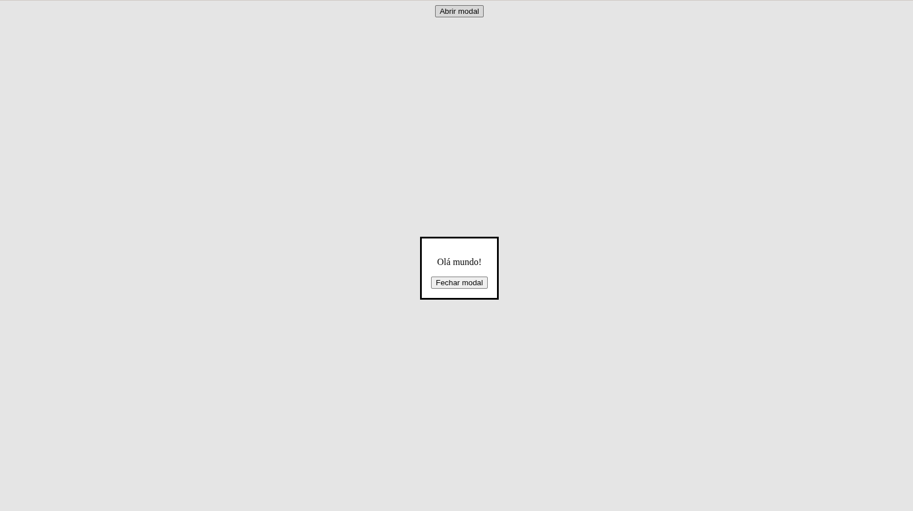
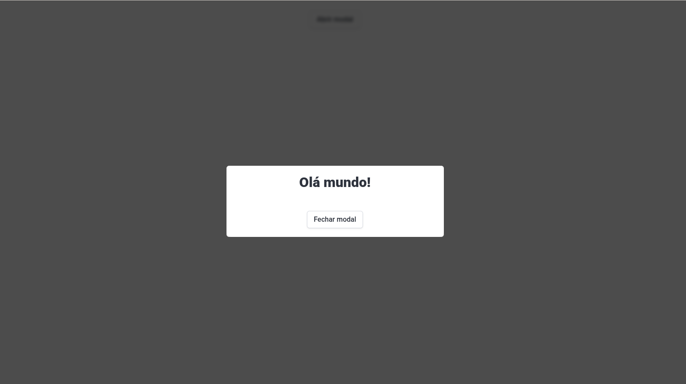

Apesar de ser um Desenvolvedor de Software Sênior, deparei-me, dias atrás, com um elemento html que não conhecia: o [dialog](https://developer.mozilla.org/pt-BR/docs/Web/HTML/Reference/Elements/dialog). Talvez por trabalhar com software legado, que já possui um layout padronizado, com elementos já definidos, não tenha percebido a chegada dessa novidade tão importante para o desenvolvimento de interfaces web. Dei uma olhada na [documentação](https://developer.mozilla.org/pt-BR/docs/Web/HTML/Reference/Elements/dialog) e decidi registrar aqui. Essa funcionalidade está disponível em todos os navegadores desde março de 2022:

> This feature is well established and works across many devices and browser versions. It’s been available across browsers since March 2022.

> Some parts of this feature may have varying levels of support.

Este elemento é uma **caixa de diálogo** para criar modais, alertas ou algum outro elemento interativo.  

## Vantagens

1. Você não precisa de libs js pesadas para criar um simples modal;
2. Acessibilidade nativa: foco automático, acesso para leitores de telas, tecla *ESC* para fechar;
3. Backdrop: Você não precisa criar uma *div* extra para fazer o fundo, basta usar o pseudo-elemento *::backdrop*

Fiz uma pequena implementação, para ver o elemento funcionando:

```html
<div style="text-align: center">
    <button id="openModal">Abrir modal</button>
    <dialog id="modal">
        <p>Olá mundo!</p>
        <button id="closeModal">Fechar modal</button>
    </dialog>
</div>
<script>
    const modal = document.getElementById("modal");
    const open = document.getElementById("openModal");
    const close = document.getElementById("closeModal");
    open.addEventListener("click", function () {
        modal.showModal();
    });
    close.addEventListener("click", function () {
        modal.close();
    });
</script>
```
Eis o resultado abaixo:



Para dar uma aparência melhor ao elemento, adicionei o [Bulma](https://bulma.io/) via cdn:

```html
<link
        rel="stylesheet"
        href="https://cdn.jsdelivr.net/npm/bulma@1.0.4/css/bulma.min.css"
    />
```

Um pouco de estilização no próprio código da tela:

```html
<style>
    dialog {
        border: none;
        border-radius: 6px;
        padding: 0;
        max-width: 90%;
        width: 500px;
    }
    dialog::backdrop {
        background-color: rgba(0, 0, 0, 0.7);
        backdrop-filter: blur(4px);
    }
</style>
```
E esse é o resultado final:



Abaixo, segue o código completo que corresponde a imagem acima:

```html
<!doctype html>
<html lang="en">
    <head>
        <meta charset="UTF-8" />
        <meta name="viewport" content="width=device-width, initial-scale=1.0" />
        <title>Dialog</title>
        <link
            rel="stylesheet"
            href="https://cdn.jsdelivr.net/npm/bulma@1.0.4/css/bulma.min.css"
        />
        <style>
            dialog {
                border: none;
                border-radius: 6px;
                padding: 0;
                max-width: 90%;
                width: 500px;
            }
            dialog::backdrop {
                background-color: rgba(0, 0, 0, 0.7);
                backdrop-filter: blur(4px);
            }
        </style>
    </head>
    <body>
        <div class="has-text-centered">
            <br />
            <button id="openModal" class="button">Abrir modal</button>
            <dialog id="modal">
                <div class="box">
                    <h3 class="title is-3">Olá mundo!</h3>
                    <br />
                    <button id="closeModal" class="button">Fechar modal</button>
                </div>
            </dialog>
        </div>
        <script>
            const modal = document.getElementById("modal");
            const open = document.getElementById("openModal");
            const close = document.getElementById("closeModal");
            open.addEventListener("click", function () {
                modal.showModal();
            });
            close.addEventListener("click", function () {
                modal.close();
            });
        </script>
    </body>
</html>
```

Obrigado e, até a próxima postagem!

## Referências

> O elemento Dialog - HTML: Linguagem de Marcação de Hipertexto | MDN. Disponível em: <a href="https://developer.mozilla.org/pt-BR/docs/Web/HTML/Reference/Elements/dialog" target="_blank">{'https://developer.mozilla.org/pt-BR/docs/Web/HTML/Reference/Elements/dialog'}</a>. Acesso em: 24 abr. 2026. ‌

> Official bulma documentation. Disponível em: <a href="https://bulma.io/documentation" target="_blank">{'https://bulma.io/documentation'}</a>. Acesso em: 24 abr. 2026.
